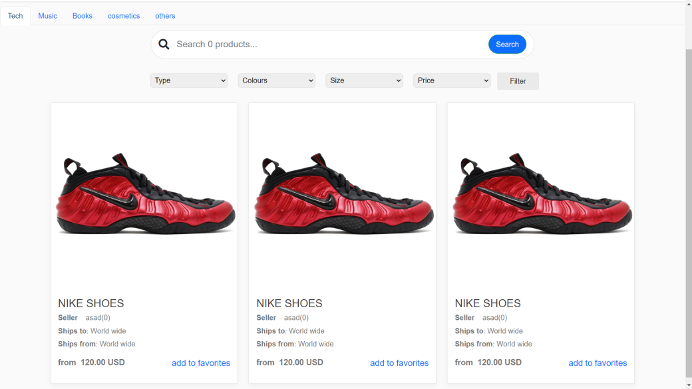
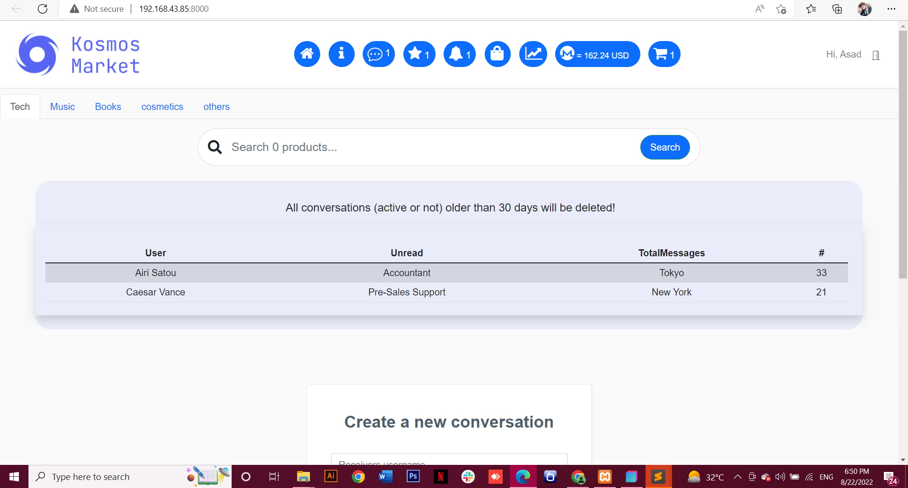

## UI

## About
A market inspired by the old Silk Road, decentralized and with multiple vendors. It allows anyone to set up a secure TOR marketplace, independent of other centralized services.

## Install
Download the Anon2.zip file
install composer
create DB name:market
import database tables (download market.sql )
sign up for new account, enjoy!

## Resources
- [x] Two-factor authentication
- [x] Multiple vendors
- [x] Support system 
- [x] Autoencrypt
- [x] Cart
- [x] PIN
- [x] Affiliate system
- [x] Favorites (vendor and product)
- [x] Messages
- [x] Panel admin
- [x] Panel moderator
- [x] Vendor profile
- [x] Monero payment
- [ ] Bitcoin payment
- [x] Featured products
- [x] Finalize Early        
- [ ] Multising
- [x] Reporting system
- [x] Javascript alert enabled
- [x] Wiki

## Endnotes
The script has not yet been tested in production. Use this web app only in accordance with current legislation. Misuse of this software may raise legal and ethical issues that I do not support and cannot be held responsible for.
